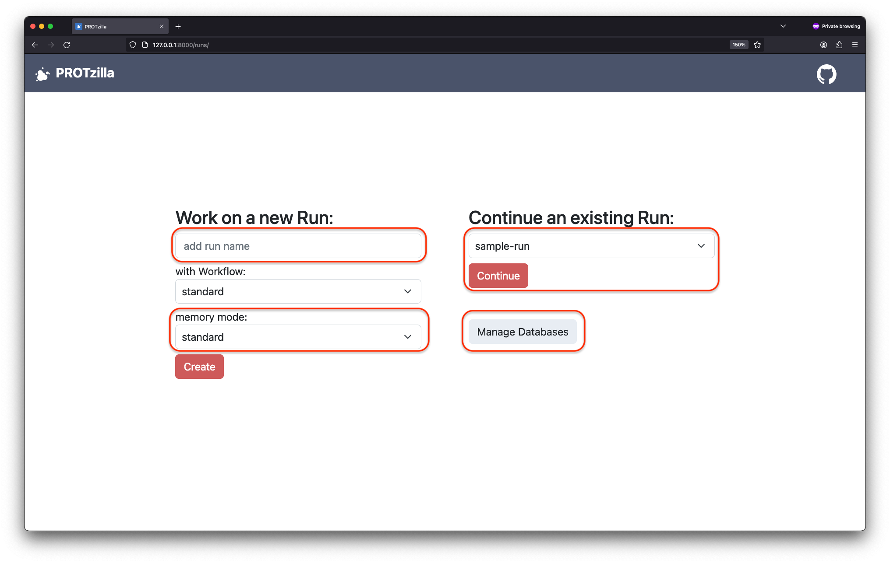
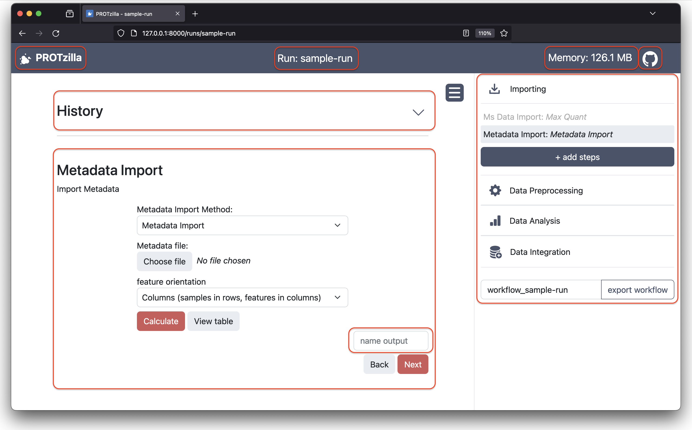

This documentation is meant to give new users an overview of the structure of PROTzilla and where data sets and calculation results are saved. For an install-guide and a quick-start-guide, please take a look at the [README.md](../README.md).

# Concepts
There are a few key concepts that one needs to understand to effectively use and communicate about PROTzilla. They are explained in the following paragraph.

- **Workflow**: A workflow is a construct that specifies how data is being handled, what calculations are performed in what order and what graphics are created.  When providing the same data, a workflow will always result in the same results. All workflows are saved in their own `.json` files, located at `<path to PROTzilla>/user_data/workflows/<workflow name>`.

- **Run**: A run is the application of a workflow, the workflow on a given data set. In a run the workflow can be modified. It is for example possible to add additional preprocessing steps, remove other ones or apply different analysis methods. When all steps in a run are completed, this potentially modified workflow can be exported under a new name for later use.

## Structure
PROTzilla is split into four sections, **Importing**, **Data Preprocessing**, **Data Analysis** and **Data Integration**. A workflow starts with the importing section, continues with data preprocessing and finishes with data analysis and data integration. These last two steps can be intertwined.

# Using PROTzilla

> [!NOTE]
> DO NOT use your browsers "back" and "forward" buttons, especially while the website is loading (when calculating a method). It is quite likely to break the run you are working on and is hard to recover.

## Starting the UI
To start using PROTzilla, please take a look at the README.md. This is where you'll find an install-guide and some basic information.
After installing PROTzilla, starting the webserver and opening the address/link you are presented with (usually http://127.0.0.1:8000) you directed to the start page of PROTzilla.

## Start Page
Here is where you start new runs, continue previously worked-on ones and can manage your databases.

When creating a run give it a name that is easy to remember and expressive. You have to choose a workflow as basis for the run. Take a look at the names and select one that sounds appropriate for your usage. If you are unsure, select the standard workflow. You can add and remove any step to any workflow in a given run. At last, you can select the memory mode for the run. This determines if dataframes are written to disk after every step, kept in memory or both. Generally, there is almost no reason to use any other mode than "Standard". "Low Memory" doesn't keep data frames in memory and will make stepping through a workflow and inspecting dataframes much slower but might save some memory.

Continuing a run does exactly what it sounds like. You are presented with a list of runs that have previously been created and can be continued where they were left of.

Lastly, you can manage databases for the UniProt integration into PROTzilla. Please refer to the corresponding section in this document ([UniProt usage in PROTzilla](#uniprot-usage-in-protzilla)).

 

## Working on a Run
When creating a new Run or continuing an old one, you will be presented with something similar to the following:

### The Current Step
Here you can pick the method and set the input values of the step you are currently working on. This will look different, depending on the step and method you selected. The "Calculate", "Back" and "Next" buttons are always present but not always active, depending on the state of the caluclation and input values.
It is also very important to only navigate using the "Back" and "Next" buttons. Using the buttons of your browser will likely mess up the run you are working on. Don't press the "Calculate"-Button while you don't have all necessary parameters set.
After calculating the current step in the "Data Analysis" and "Data Integration" sections a "naming" field will appear. Here, you can name the output of the current step to use as input in a later step. These names have to be unique and may not be "dataframe".

### The History
In this (collapsible) part of the UI, you can look at past steps and chosen parameters. You can also name the output of past steps here if you have not done so previously (only in the *Data Analysis* and *Data Integration* section). You can also inspect the output of the respective steps here by clicking "View Table" and selecting an output you are interested in in the new tab that will open.

### The Sidebar
The Sidebar, also collapsible using the "Hamburger Menu", is located at the right side of the UI and the place where you can get an overview of the already chosen steps to come, what you have computed so far. You can look at future and past sections by clicking on them; they are collapsible. Using the small cross next to future steps, you can remove them. You can also add steps from the current section as the next upcoming step when pressing "+ add steps".
Finally, at the bottom of the sidebar, you can name and export the workflow of the run you are currently working on as is. It will be saved alongside the other workflows in `<Path to PROTzilla>/user_data/workflows/<run name>`.
> [!NOTE]
> Make sure you add steps that are dependent on each other in the correct order and potentially ahead of time. For example, the is no way of importing meta-data after you leave the  import  section. You, therefore, either have to import the meta data right at the beginning of your run or you will have to step back all the way to the  import section when you later on realize you need it.

### Miscellaneous
- In the top right of the UI, you will find an indicator as to how much memory is currently used for data frames.
- Pressing the Octocat-Logo, you will be sent to the Github Repository in which PROTzilla is developed.
- The logo and "PROTzilla"-Text in the top left leads back to the start page.

# UniProt usage in PROTzilla
To make use of the UniProt integration in PROTzilla, tables with information onproteins need to be added to PROTzilla via the Databases page. Afterward, theycan be used for Gene mapping if they contain a `Gene Names` or `Gene Names (primary)` column, or for adding UniProt data to a PROTzilla table.

By using the [UniProt website](https://www.uniprot.org/uniprotkb?query=), tables, that contain the proteins that interest you with the columns that you need, can be downloaded.

### How to query UniProt

In the sidebar on the left, you can choose if you want all proteins, or just the reviewed ones, as well as select proteins by species or other characteristics. If you are interested in characteristics that are not shown or want to choose a different organism, you can use the "Advanced" button in the search bar at the top. With the advanced search, you can build complex conditions for what proteins should be contained in the result out of pairs of field and value, such as "Taxonomy: Homo sapiens AND Reviewed: Yes". More information can be found [here](https://www.uniprot.org/help/filter_options). The number of results is shown above the table that displays the first few results. The columns that are visible can be changed with the "Customize columns" button above the table. There is a vast selection of columns available.

### Downloading from UniProt

When you have selected the proteins that you want to download to be added to PROTzilla, you can click the "Download" button above the table. In the "Format" selector, you need to choose "TSV". If you select "Compressed: Yes", you will need to decompress the file before adding it to PROTzilla.

In the "Customize columns" section, you need to choose the columns that you want to have available in PROTzilla. When you click the "Download" button at the bottom, a browser download will start. The download could take several minutes if you have selected more than 100,000 proteins or many columns. If you have selected more than 10,000,000 proteins, the file will be generated and you can download it later.

### Adding to PROTzilla

As a last step, the downloaded file needs to be added to PROTzilla. This is
done via the databases page, which can be reached by clicking on the "Manage 
Databases" button on the main page. Then, you have to input a name and select 
the file for upload. After the "Add new database" button is clicked, the table
is available for adding info and mapping genes, and is listed at the bottom of
the tables page.
